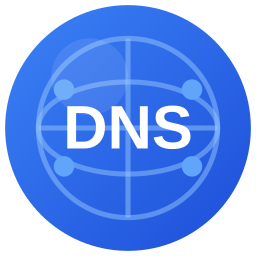

<div align="center">



# PRIVUM DNS Manager

**Open-source web GUI for BIND 9 — manage zones, records and secondary servers from one dashboard.**

A free, self-hosted **BIND9 web interface** for teams who run their own authoritative DNS —
no more hand-editing zone files, bumping serials and remembering `rndc` flags.

[](LICENSE)


Made with care by **[Privum Cloud »](https://privum.cloud)**

</div>

---

PRIVUM DNS Manager puts a modern web UI in front of a real BIND 9 install. It doesn't replace
BIND or proxy it — it **writes your zone files and drives `rndc` directly**, so what you see in
the browser is exactly what `named` is serving. Add a primary, register secondaries, and zone
transfers are configured for you. It's for sysadmins, homelabbers, MSPs and internal platform
teams who want authoritative DNS they control, with a UI their whole team can use.

> 🌐 **Product page:** [privum.cloud/dns-manager](https://privum.cloud/dns-manager/)

## Why PRIVUM DNS Manager

BIND 9 is the most widely deployed authoritative DNS server in the world — and it ships with no
web interface at all. The usual options are editing zone files over SSH, a general-purpose
server-admin panel that happens to include a BIND module, or a commercial DNS appliance.

This project is the missing piece in between: a focused, **open source DNS server GUI** that does
one job well. If you've been searching for a *"BIND9 web UI"*, a *"BIND DNS GUI"* or an
*"open source DNS server with a web interface"*, that's exactly what this is — with multi-user
access control, an audit trail and primary/secondary replication built in.

A longer walkthrough, with screenshots and the feature comparison, lives on the
[**PRIVUM DNS Manager product page »**](https://privum.cloud/dns-manager/).

## Features

- **Zones and records in the browser** — full CRUD for `A`, `AAAA`, `CNAME`, `MX`, `TXT`, `NS`,
  `PTR`, `SRV` and `CAA`. Serial numbers are bumped for you on every change.
- **Validated before it goes live** — every write is checked with `named-checkzone` before the
  file is saved, then applied with `rndc reload`. A broken zone never reaches `named`.
- **Primary / secondary replication** — register a secondary with a one-time token and the
  installer configures AXFR, `allow-transfer` and `NOTIFY` on both ends.
- **Role-based access control** — `admin`, `operator` and `viewer`, so the whole team can look
  without the whole team being able to change.
- **Two-factor authentication** — TOTP (Google Authenticator, Aegis, any RFC 6238 app) with
  backup codes.
- **Optional SSO** — Keycloak / OIDC, with Keycloak groups mapped to roles. Local admin login
  stays available as a break-glass path.
- **Audit trail** — every zone, record, user and settings change is recorded with who, what and
  when.
- **Backup and restore** — one-click zone and database backups, with daily/weekly/monthly
  retention policies and restore from the UI.
- **REST API** — everything the UI does is an API call, so it automates.
- **Native install, no containers** — systemd services and a single install script. SQLite by
  default, PostgreSQL if you want it.

## Quick start

Requires **Ubuntu 22.04 / 24.04** or **Rocky Linux 8 / 9**, with Python 3.9+, Node.js 20 and
BIND 9.16+ (the installer pulls what's missing).

### Primary server

```bash
curl -fsSL https://get.privum.cloud/dns | sudo bash -s -- --master
```

The installer sets up BIND 9, the API, nginx and the web UI, then prints your admin password and
a 24-hour secondary-server token. Open `http://<server-ip>` and log in.

### Secondary server

Run this on the second machine, using the token from the primary's install summary
(also saved at `/opt/dns-manager/slave-token.txt`):

```bash
curl -fsSL https://get.privum.cloud/dns | sudo bash -s -- \
  --slave --master-ip=<PRIMARY_IP> --token=<TOKEN>
```

Need a fresh token later? Generate one against the API as an admin:

```bash
curl -X POST http://<primary-ip>/api/slaves/tokens \
  -H "Authorization: Bearer <JWT>" -H "Content-Type: application/json"
```

## Configuration

Settings live in `/opt/dns-manager/.env` — see [`.env.example`](.env.example) for every option.
The ones that matter most:

| Variable | Description | Default |
|---|---|---|
| `FLASK_SECRET_KEY` | JWT signing key — **required**, generate a random one | – |
| `FLASK_ENV` | `production` or `development` | `production` |
| `CORS_ORIGINS` | Comma-separated allowed origins | localhost |
| `DATABASE_URL` | Set for PostgreSQL; unset uses SQLite | SQLite |
| `KEYCLOAK_ENABLED` | Turn on SSO | `false` |

Setting up Keycloak SSO is a guide of its own → **[docs/SSO-KEYCLOAK.md](docs/SSO-KEYCLOAK.md)**.

## Architecture

```
                        PRIMARY SERVER
   ┌──────────────────────────────────────────────────────┐
   │   nginx :80        Flask API :5000        BIND 9 :53 │
   │   React SPA   ──▶  (gunicorn)        ──▶  named      │
   │                    SQLite / PostgreSQL    zone files │
   └──────────────────────────────────────────────────────┘
                             │
                             │  AXFR + NOTIFY  (RNDC-keyed)
                             ▼
                       SECONDARY SERVER(S)
   ┌──────────────────────────────────────────────────────┐
   │   BIND 9 :53  ◀── zone agent :5001 (config sync)     │
   └──────────────────────────────────────────────────────┘
```

- **Web UI** — React 18 + TypeScript + Vite + Tailwind, served as static files by nginx.
- **API** — Flask + SQLAlchemy behind gunicorn, bound to localhost and reverse-proxied.
- **DNS control** — the API writes zone files directly and issues `rndc` commands; there is no
  daemon in between and no vendored fork of BIND.
- **Replication** — DNS data moves by standard AXFR/NOTIFY between BIND instances. A small agent
  on each secondary keeps `named.conf.local` in sync as zones are added and removed.

More detail in **[docs/ARCHITECTURE.md](docs/ARCHITECTURE.md)**.

## Documentation

| Guide | What's in it |
|---|---|
| [Architecture](docs/ARCHITECTURE.md) | Components, data flow, file layout |
| [Operations](docs/OPERATIONS.md) | Services, logs, file locations, troubleshooting |
| [Keycloak SSO](docs/SSO-KEYCLOAK.md) | Realm, client and group-to-role setup |
| [Backup strategy](docs/BACKUP-STRATEGY.md) | What's backed up, retention, restore |
| [Roadmap](docs/ROADMAP.md) | What's shipped and what's next |
| [Security](SECURITY.md) | Hardening guidance and how to report a vulnerability |

## Development

```bash
# API
cd web-manager
python3 -m venv venv && source venv/bin/activate
pip install -r requirements.txt
python app.py                 # http://localhost:5000

# Web UI
cd frontend
npm install
npm run dev                   # http://localhost:3000, proxies /api to :5000
npm run lint
npm run build
```

## Running DNS in production?

DNS Manager is free and self-hosted, and it stays that way. If you'd rather someone else carried
the pager for it — or for the Kubernetes, observability and security stack around it —
[**Privum Cloud »**](https://privum.cloud) does that as a service:

- [**Managed DNS & infrastructure**](https://privum.cloud/dns-manager/) — this stack, run for you
- [**24/7 SRE & NOC**](https://privum.cloud/noc-operations/) — monitoring, on-call and incident response
- [**DevSecOps & cloud security**](https://privum.cloud/cybersecurity/) — hardening, pentests, compliance

## Contributing & feedback

This project is young and moving, and **your feedback shapes it** — please don't hesitate:

- 🐛 **Something broken?** [Open an issue](https://gitlab.com/privum_public/dns_manager/-/issues)
  with your distro, BIND version and what you expected.
- 💡 **Want a feature?** Record types, DNSSEC, an import path from another DNS server — say so.
  The [roadmap](docs/ROADMAP.md) is shaped by what people ask for.
- 🔧 **Code?** Merge requests are welcome. Fork, branch, and describe the change.

## Security

Please **don't** open a public issue for security problems — see
[SECURITY.md](SECURITY.md) for how to report them privately.

Before exposing an install to a network you don't fully control:

- Put TLS in front of it — the bundled nginx config serves plain HTTP by default.
- Change the admin password and enable 2FA on every admin account.
- Restrict who can reach port 53 and the web UI at the firewall.
- Set a strong random `FLASK_SECRET_KEY`; the API warns loudly if you don't.

## License

Licensed under the **GNU Affero General Public License v3.0 or later** — see [`LICENSE`](LICENSE).

Copyright (C) 2024-2026 PRIVUM.

Because this is network software, AGPL section 13 applies: if you run a **modified** version and
let other people use it over a network, you must offer those users the corresponding source of
your modified version. Running it unmodified, or modifying it for purely internal use, creates
no such obligation.

> Releases up to and including v2.0.0 were published under the MIT License and remain available
> under those terms; the change to AGPLv3 applies from that point forward.

---

<div align="center">

Built and maintained by **[Privum Cloud](https://privum.cloud)** — Kubernetes, DevSecOps & 24/7 SRE.

</div>
